<div align="center">
 
 [](https://git.io/typing-svg)
 
 [](https://tanawat.web.app/)
 
</div>

<div align="left">

 []([https://github.com/tanawat011](https://www.facebook.com/tanawat.pin))
 []([https://github.com/tanawat011](https://www.instagram.com/ta.tanawat.pin/))
 []([https://github.com/tanawat011](https://www.linkedin.com/in/tanawat-pinthongpan-683a84167/))
 [](mailto:tanawat.works@gmail.com)
 [](https://github.com/tanawat011)
 
 
</div>  
<p align="justify"> 
Hello 🖐️ friends, welcome to my github
I am satisfied and I tried most fields of programming such as mobile application development, web design and development, etc., and finally I was able to find my interest, and that was web design and development and security. It has been almost 5 years. I am coding and now I am a fullstack developer
&nbsp;

In addition to my personal website, you can also follow my main page called [Tanawat](https://www.instagram.com/ta.tanawat.pin/) on Instagram. And this is my [Portfolio](https://tanawat.web.app/) website
</p>


<p align="left">
I code with Framework, Platform and Libraries:  👇
 
 
 
 
 
 
 

I code with Languages:  👇
 
 
 
 
 
 

I code with Database:  👇
 
 
 
 
 
 
OS, Tools and IDEs:  👇
 
 
 
 
 
 
 
 
 
</p>

&nbsp;
&nbsp;
## 📊 Github stats

<div align="">
 
💻 GitHub Profile Stats
 
 [](https://github.com/tanawat011/tanawat011)
 [](https://github.com/tanawat011/tanawat011)

</div>

<div align="">
 
⚡ Recent GitHub Activity
 
 [](https://github.com/tanawat011/tanawat011)
 [](https://github.com/tanawat011/tanawat011)
 [](https://github.com/tanawat011/tanawat011)
 [](https://github.com/tanawat011/tanawat011)
 
</div>

<!--START_SECTION:waka-->

```text
From: 03 August 2023 - To: 02 August 2024

Total Time: 11 hrs 39 mins

TypeScript   9 hrs 14 mins   ⣿⣿⣿⣿⣿⣿⣿⣿⣿⣿⣿⣿⣿⣿⣿⣿⣿⣿⣿⣀⣀⣀⣀⣀⣀   75.79 %
JSON         1 hr 2 mins     ⣿⣿⣄⣀⣀⣀⣀⣀⣀⣀⣀⣀⣀⣀⣀⣀⣀⣀⣀⣀⣀⣀⣀⣀⣀   08.54 %
Dart         41 mins         ⣿⣤⣀⣀⣀⣀⣀⣀⣀⣀⣀⣀⣀⣀⣀⣀⣀⣀⣀⣀⣀⣀⣀⣀⣀   05.66 %
Other        31 mins         ⣿⣀⣀⣀⣀⣀⣀⣀⣀⣀⣀⣀⣀⣀⣀⣀⣀⣀⣀⣀⣀⣀⣀⣀⣀   04.29 %
```

<!--END_SECTION:waka-->
